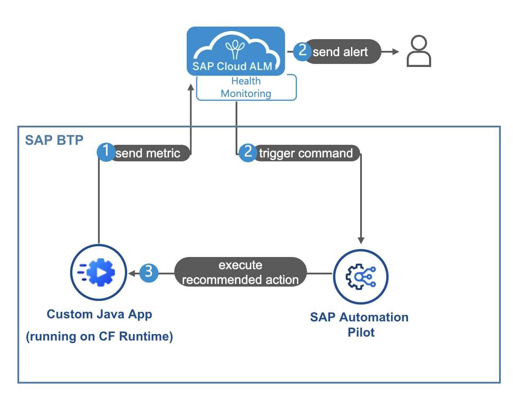
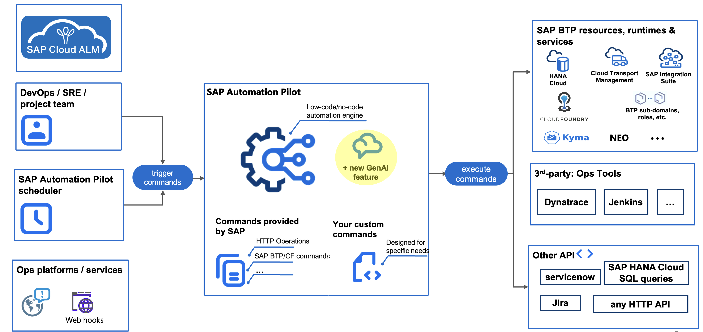

# XP270 - Reduce Your Operation Efforts for SAP BTP with SAP Cloud ALM

## Description

This repository contains the material for the SAP TechEd 2023 session XP270 - Reduce Your Operation Efforts for SAP BTP with SAP Cloud ALM.
Get a detailed overview of the health monitoring capabilities in SAP Cloud ALM. Learn to monitor your cloud application running on SAP Business Technology Platform (SAP BTP). Find out how to use the SAP Automation Pilot service (triggered from health monitoring) for automated event remediation.  
## Overview

You will setup and use SAP Cloud ALM Health Monitoring for a customer developed application deployed  in a SAP BTP Cloud Foundry subaccount. Eventually SAP Cloud ALM will trigger an alert that something is not in order with the application. You will define an automation pilot command for automated event remediation and trigger it from the alert in SAP Cloud ALM. Afterwards you will check in monitoring that the command has solved the problem.

## Solution Diagram explained

### Main concept
We use SAP Cloud ALM – Health Monitoring for monitoring of a custom developed Java app running on BTP Cloud Foundry Runtime. In case there is an incident with the app, there is an alert generated SAP Cloud ALM which triggers the execution of corrective action performed on SAP BTP by SAP Automation Pilot.​

### Automated scenario​
As an alert about high app disk storage comes up in SAP Cloud ALM, a command in SAP Automation Pilot is triggered automatically that clears the temp storage and / or restarts the app (if needed). The output of the command is then automatically sent via a notification.​

> [!Note]
> You will get to know better SAP Automation Pilot so feel free to check out this product capabilities overview as well.

## Requirements

The requirements to follow the exercises in this repository are: 
* Very basic knowledge in BTP Cockpit
* Please use the Chrome browser on your Teched laptop

## Exercises

- [Getting Started](exercises/ex0/)
- [Exercise 1 - Configure monitoring and alerting in SAP Cloud ALM](exercises/ex1/)
- [Exercise 2 - Build self healing command](exercises/ex2/)
- [Exercise 3 - Check alert and resolve problem](exercises/ex3/)
  
## Contributing
Please read the [CONTRIBUTING.md](./CONTRIBUTING.md) to understand the contribution guidelines.

## Code of Conduct
Please read the [SAP Open Source Code of Conduct](https://github.com/SAP-samples/.github/blob/main/CODE_OF_CONDUCT.md).

## How to obtain support

Support for the content in this repository is available during the actual time of the online session for which this content has been designed. Otherwise, you may request support via the [Issues](../../issues) tab.

## License
Copyright (c) 2023 SAP SE or an SAP affiliate company. All rights reserved. This project is licensed under the Apache Software License, version 2.0 except as noted otherwise in the [LICENSE](LICENSES/Apache-2.0.txt) file.
