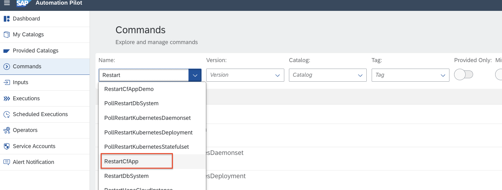

# Exercise 2 - Exercise 2 Description

You inform the developer of the `perfumeStore` app of the disk utilization problem. He advises to set couple of possible remediation actions and build automated flows for these such as: 
- clear the diskspace as soon as it has exceeded a certain limit;
- restart the app (in case the issue occurs over again).

During this exercise you will create a command to clean the disk space using SAP Automation Pilot and register the command as operation flow in SAP Cloud ALM. 

## Exercise 2.1 - Define commmands for an automated remediations via SAP Automation Plot   

### 2.1.1 - Command: "Restart App" in SAP Automation Pilot 

1. Access your SAP Automation Pilot via SAP BTP cockpit  .

2.	Once you access the SAP Automation Pilot navigate to “Comands” section and look for a command named “RestartCfApp”

   
3.	Access the command and clone by adding it to the respective catalog as shown on the screenshot and name it “{your session ID}.(user ID).RestartCfAppDemo”, e.g. "XP270.001.RestartCfAppDemo" ,  "XP270.002.RestartCfAppDemo", etc.

  	
4.	Explore the setup of your BTP Technical User that is already made for you in SAP Automation Pilot. To do so - click on the “Inputs” section within the leftsidebar, then look for the inputs named `btpTechnicalUser` 

> [!NOTE]
> Do not modify the inpouts for the Technical user. Password for the BTP Technical user is not visible for you as it was added in advance as a senstive string. 

5.	Now you are good to go and navigate back to the command you have created so that you can add all the needed input keys so that the command can be triggered and executed successfully.

7.	Add the needed execution as shown below

9.	Map the input keys to the execution you have created in the previous step:

10.	Commands outputs values  – it is a good practice to prepare the needed command outputs so that you can check out what was the output after rinning the command. Please follow the guidance shared below: 

12.	Command output keys will be printed here

Now you are ready to trigger the command manually or automatically via SAP Cloud ALM. 

### 2.1.2 - Command: "Delete App Temp Storage" in SAP Automation Pilot 

1. Access your SAP Automation Pilot via SAP BTP cockpit  .

2.	Once you access the SAP Automation Pilot navigate to “Comands” section and look for a command named `HttpRequest`

   
3.	Access the command and clone by adding it to the respective catalog as shown on the screenshot and name it “{your session ID}.(user ID).deleteAppTemStorageDemo”, e.g. "XP270.001.deleteAppTemStorageDemo" ,  "XP270.002.deleteAppTemStorageDemo", etc.

4.	Add the needed input keys so that the command can be triggered and executed successfully.
What you need to specify within the commands input keys are just two inputs:
- `method` to be set to `GET`

- `url` - that is `{app_url}/delete-file` resulting in athe  app endpoint which can be called in order to delete the temp storage.

> [!NOTE]
> endpoint is {app_url}/delete-file
> app_url can be found via SAP BTP Cockpit as explained here: "BTP Cockpit" --> "Spaces" --> click on the desired space (in your use case you should be able to see just one space, so click on the spacenamed "prod") --> clik on the app name (e.g. `perfumeSrore`) and you shall see the Applicaiton Overview scree. Check out the "Application Routers" URL - this is your App URL that shall be copied and used. 

7.	Add the needed execution as shown below

9.	Map the input keys to the execution you have created in the previous step:

10.	Commands outputs values  – it is a good practice to prepare the needed command outputs so that you can check out what was the output after rinning the command. Please follow the guidance shared below: 

12.	Command output keys will be printed here

Now you are ready to trigger the command manually or automatically via SAP Cloud ALM. 

## Exercise 2.2 - Register command as Operation Flow in SAP Cloud ALM  

The previously defined command "Delete App Temp Storage"needs to be registered in SAP Cloud ALM so that SAP Cloud ALM can trigger it. 

1. Logon to SAP Cloud ALM.

2. Select “Operations Automation”.

3. Select “Register Operation Flow”.

4. Select “SAP Automation Pilot”.

5. Select Endpoint XP270_XXX (replace XXX with your number )

6. Select the command you created earlier (XP270.XXX.deleteAppTemStorageDemo.)

7. Leave input reference empty.

8. Optionally enter a description.

9. Select Use Case “Health Monitoring”.

10. Select Ok.

11. Now the command should appear in the list of operation flows. 

## Summary

You've now all commands for automated remediations modeled and stored in SAP Automation Pilot and also have integrated your SAP Cloud ALM to SAP Automation Pilot. Now the commands in questions can be triggered automatically or manually via Cloud ALM. 

Continue to - [Exercise 3 - Excercise 3 ](../ex3/README.md)
